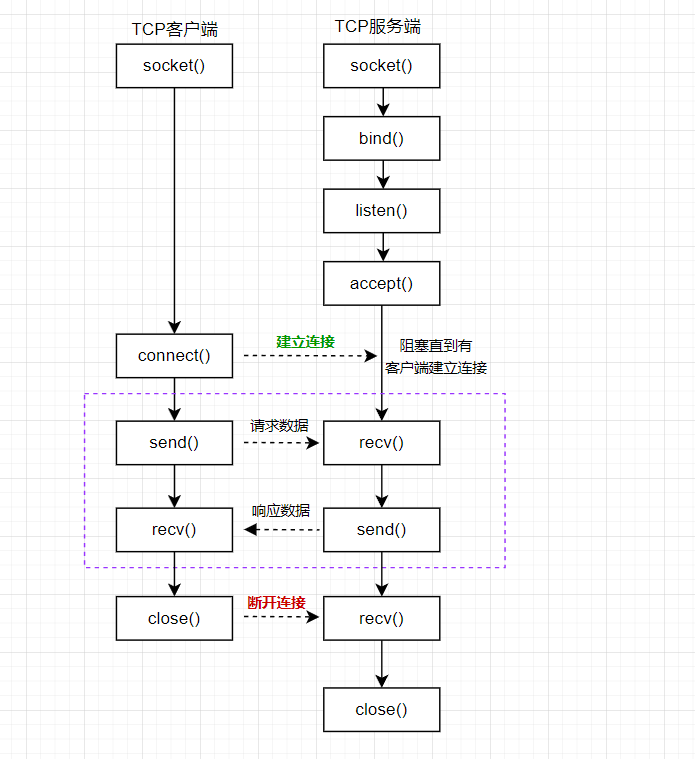
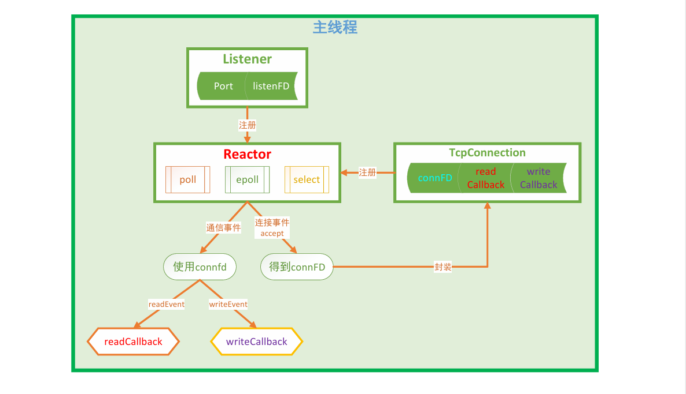
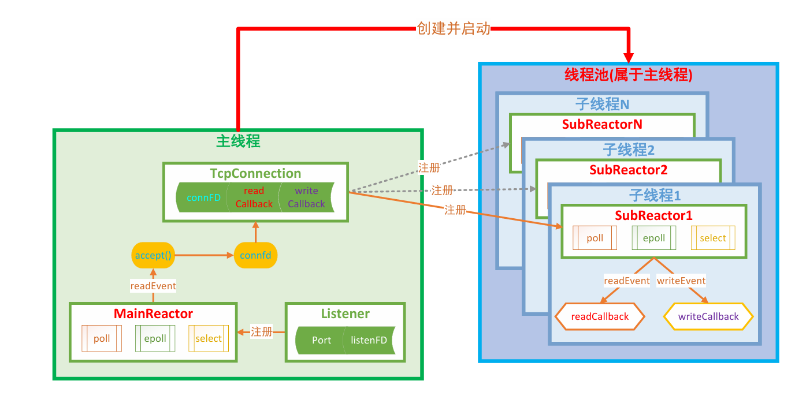
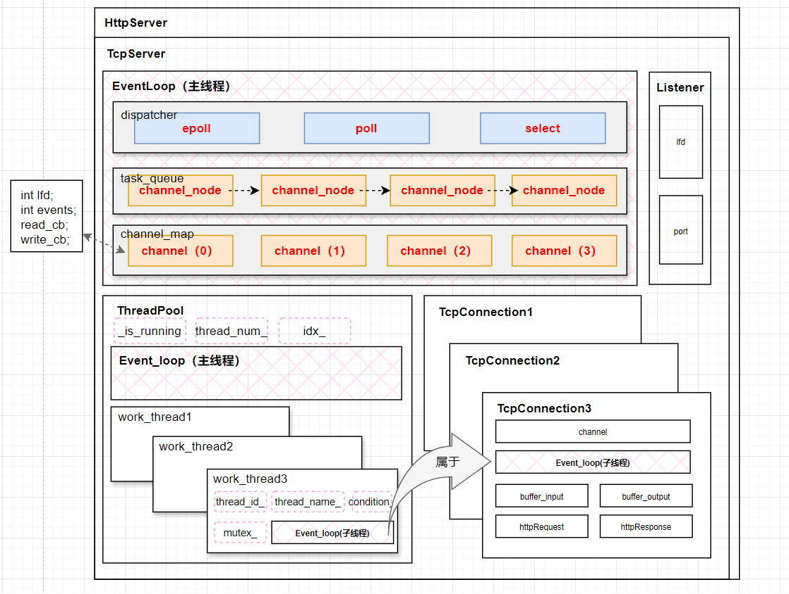
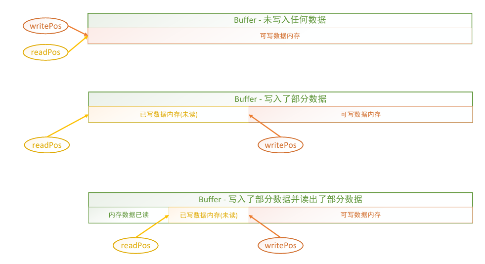
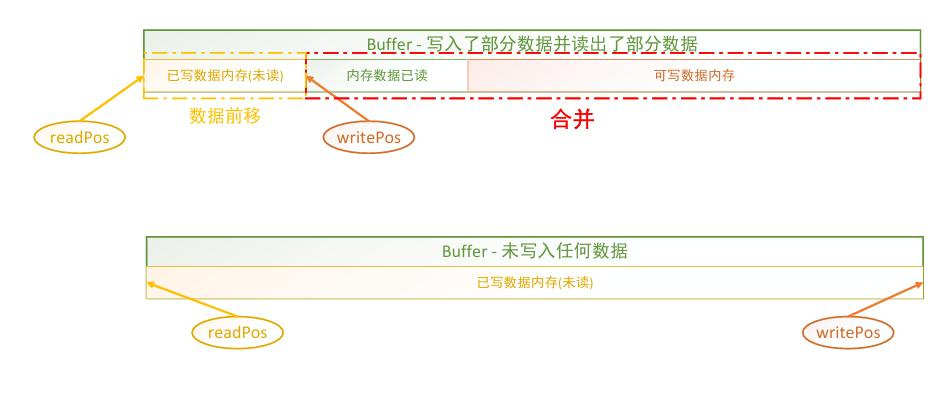
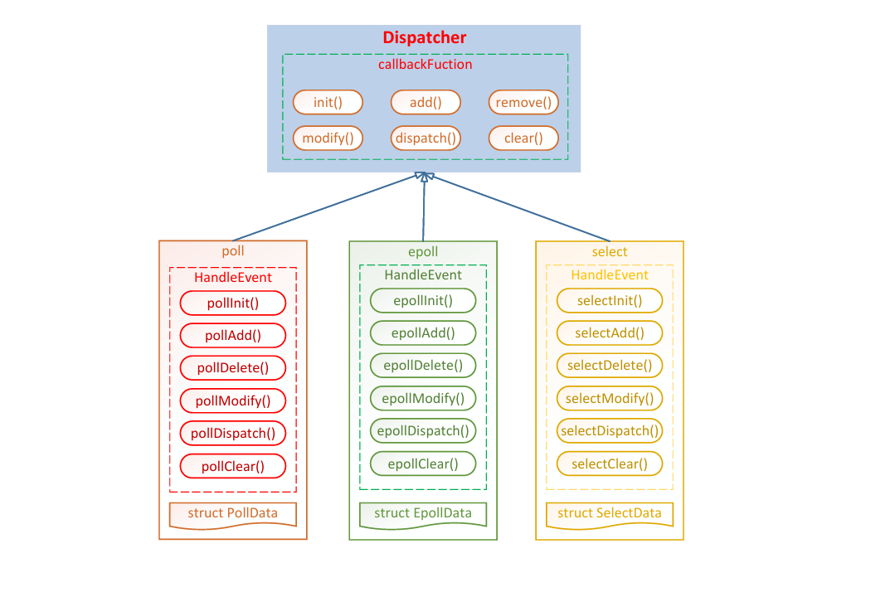
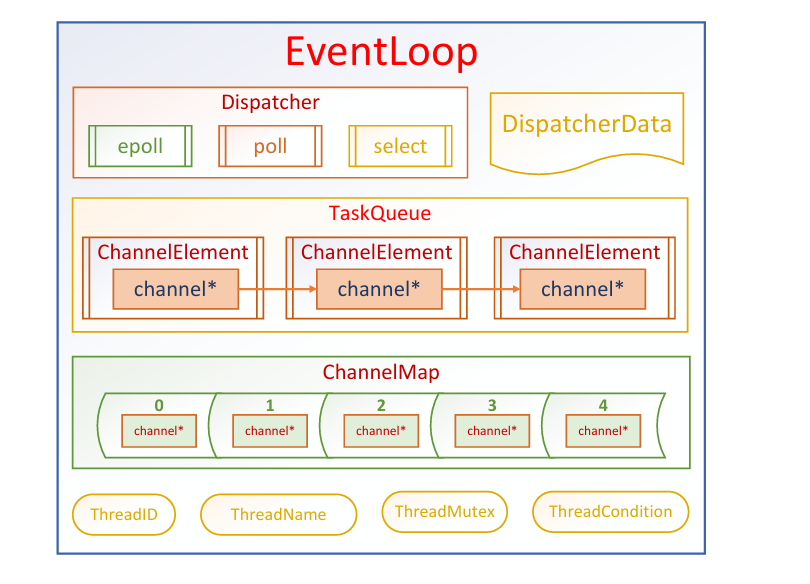
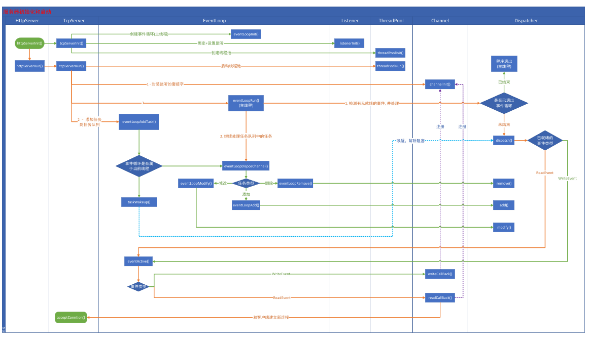

# 基础知识

---

### 1.通信流程

TCP是一个面向连接的、安全的、流式传输协议，该协议属于传输层协议。

1. 面向连接：是一个双向连接，通过三次握手完成，断开连接需要通过四次挥手完成。
2. 安全：tcp通信过程中，会对发送的每一数据包都会进行校验, 如果发现数据丢失, 会自动重传
3. 流式传输：发送端和接收端处理数据的速度，数据的量都可以不一致



#### server

1. 创建用于监听的套接字，int lfd = socket();
2. 将得到的监听的文件描述符和本地的IP 端口进行绑定，bind();
3. 设置监听客户端连接，listen();
4. 等待并接受客户端的连接请求，建立新的连接，会得到一个新的文件描述符（通信使用）int cfd = accept();
5. 通信，读写操作默认都是阻塞的，
   - 接收数据：read(); / recv();
   - 发送数据：write(); / send();
6. 断开连接, 关闭套接字，close();

在tcp的服务器端，有两类文件描述符：

1. 文件描述符对应内存结构：

   - 1个文件描述符对应两块内存，分别是读缓冲区和写缓冲区，
   - 读数据：通过文件描述符将内存中的数据读出，这块内存称之为读缓冲区
   - 写数据：通过文件描述符将数据写入到某块内存中，这块内存称之为写缓冲区

2. 监听的文件描述符：只需要一个，不负责和客户端通信，负责检测客户端的连接请求，检测到之后调用accept可以建立新的连接，

   - 客户端的连接请求会发送到服务器端监听的文件描述符的读缓冲区中

   - 读缓冲区中有数据，说明有新的客户端连接

   - 调用accept()函数，这个函数会检测监听文件描述符的读缓冲区

     检测不到数据该函数阻塞，如果检测到数据解除阻塞新的连接建立

3. 信的文件描述符：负责和建立连接的客户端通信，如果有N个客户端和服务器建立了新的连接, 通信的文件描述符就有N个，每个客户端和服务器都对应一个通信的文件描述符

   - 客户端和服务器端都有通信的文件描述符，

   - 发送数据：调用函数 write() / send()，数据进入到内核中

     数据并没有被发送出去，而是将数据写入到了通信的文件描述符对应的写缓冲区中，内核检测到通信的文件描述符写缓冲区中有数据, 内核会将数据发送到网络中。

   - 接收数据: 调用的函数 read() / recv(), 从内核读数据

     数据如何进入到内核开发者不需要处理，数据进入到通信的文件描述符的读缓冲区中，数据进入到内核必须使用通信的文件描述符，将数据从读缓冲区中读出即可。

#### client

1. 创建一个通信的套接字，int cfd = socket();
2. 连接服务器, 需要知道服务器绑定的IP和端口，connect();
3. 通信，读写操作默认都是阻塞的，
   - 接收数据：read(); / recv();
   - 发送数据：write(); / send();
4. 断开连接, 关闭套接字，close();

### 2.URL请求信息截取

#### sscanf

- 利用格式化输入sscanf函数实现

- 函数原型：`sscanf(const char *str, const char *format, ...)`
- 主要功能：将参数str的字符串根据参数format字符串来转换并格式化数据，转换后的结果存于对应的参数中，
  - 根据格式从字符串中提取数据，如从字符串中取出整数、浮点数和字符串等。
  - 取<font color='#BAOC2F'>指定长度</font>的字符串
  - 取到<font color='#BAOC2F'>指定字符为止</font>的字符串
  - 取仅<font color='#BAOC2F'>包含指定字符集</font>的字符串
  - 取到<font color='#BAOC2F'>指定字符集为止</font>的字符串

从 `http://www.baidu.com:1234` 中分别获取传输协议、网站域名、端口等信息

```cpp
#include <stdio.h>
int main() {
    const char *str = "https://www.baidu.com:20000";
    char protocal[32] = {0};
    char host[128] = {0};
    char port[8] = {0};
    sscanf(str, "%[^:]://%[^:]:%[1-9]", protocal, host, port);

    printf("protocal : %s\n", protocal);
    printf("host : %s\n", host);
    printf("port : %s\n", port);
    return 0;
}
```


### 3.目录遍历

#### 遍历方式1

```cpp
DIR *opendir(const char *name);//打开目录
struct dirent *readdir(DIR *dirp);//读取目录
struct dirent {
    ino_t          d_ino;       /* 文件对应的inode编号, 定位文件存储在磁盘的那个数据块上 */
    off_t          d_off;       /* 文件在当前目录中的偏移量 */
    unsigned short d_reclen;    /* 文件名字的实际长度 */
    unsigned char  d_type;      /* 文件的类型, linux中有7中文件类型 */
    char           d_name[256]; /* 文件的名字 */
};
 - DT_BLK：块设备文件
 - DT_CHR：字符设备文件
 - DT_DIR：目录文件
 - DT_FIFO ：管道文件
 - DT_LNK：软连接文件
 - DT_REG ：普通文件
 - DT_SOCK：本地套接字文件
 - DT_UNKNOWN：无法识别的文件类型
int closedir(DIR *dirp);// 关闭目录, 参数是 opendir() 的返回值
```

##### 遍历目录

```cpp
// 打开目录
DIR* dir = opendir("/home/test");
struct dirent* ptr = NULL;
// 遍历目录
while( (ptr=readdir(dir)) != NULL)
{
    .......
}
```

- 例：遍历单层目录是不需要递归，求某个指定目录下 mp3 格式文件的个数：

```cpp
int getMp3Num(const char* path) {
    //1.打开目录
    DIR* dir = opendir(dirpath);
    if(dir == NULL) handle_error("opendir");
    //2.遍历当前目录中的文件
    int count = 0;
    while(1) {
        struct dirent* ptr = readdir(dir);
        if(ptr == NULL) {
            printf("目录读完了...\n");
            break;
        }
        if(ptr->d_type == DT_REG) {
            char* p = strstr(ptr->d_name, ".mp3");
            if(p != NULL && *(p+4) == '\0') {
                count++;
                printf("file %d: %s\n", count, ptr->d_name);
            }
        }
    }
    //3.关闭目录
    closedir(dir);
    return count;
}
```

##### 递归遍历目录

递归方式进行遍历，递归结束的条件：遍历的文件如果不是目录类型就结束递归。

```cpp
int getMp3Num(const char* path) {
    //1.打开目录
    DIR* dir = opendir(dirpath);
    if(dir == NULL) handle_error("opendir");
    //2.遍历当前目录
    struct dirent* ptr = NULL;
    int count = 0;
    while((ptr = readdir(dir)) != NULL) {
        if (strcmp(ptr->d_name, ".")==0 || strcmp(ptr->d_name, "..") == 0) continue;//若为特殊目录 则跳过不处理
        if (ptr->d_type == DT_DIR) {
            /* 读到的当前文件是目录 */
            char newPath[1024];
            sprintf(newPath, "%s/%s", path, ptr->d_name);
            count += getMp3Num(newPath);//递归读取
        } else if(ptr->d_type == DT_REG) {
            /* 读到的当前文件是普通文件 */
            char* p = strstr(ptr->d_name, ".mp3");
            if(p != NULL && *(p+4) == '\0') {
                count++;
                printf("%s/%s\n", path, ptr->d_name);
            }
        }
    }
    //3.关闭目录
    closedir(dir);
    return count;
}
```

#### 遍历方式2

scandir() 函数进行目录的遍历，

只遍历指定目录，不进入到子目录中进行递归遍历，参数涉及到三级指针和回调函数的使用。

```cpp
#include <dirent.h> 
int scandir(const char *dirp,
            struct dirent ***namelist,
            int (*filter)(const struct dirent *),
            int (*compar)(const struct dirent **, const struct dirent **));
int alphasort(const struct dirent **a, const struct dirent **b);
int versionsort(const struct dirent **a, const struct dirent **b);
```

1. dirp: 需要遍历的目录的名字
2. namelist: 三级指针，传出参数，需要在指向的地址中存储遍历目录得到的所有文件的信息
   - 在函数内部会给这个指针指向的地址分配内存，要注意在程序中释放内存
3. filter: 函数指针，指针指向的函数就是回调函数，需要在自定义函数中指定如果过滤目录中的文件
   - 如果不对目录中的文件进行过滤, 该函数指针指定为NULL即可
   - 如果自己指定过滤函数, 满足条件要返回1, 否则返回 0
4. compar: 函数指针，对过滤得到的文件进行排序，可以使用提供的两种排序方式
   - alphasort: 根据文件名进行排序
   - versionsort: 根据版本进行排序
5. 返回值：函数执行成功返回找到的匹配成功的文件的个数，如果失败返回 - 1

<mark>scandir文件过滤</mark>：

scandir() 可以自定义文件的过滤方式，将过滤函数的地址传递给 scandir () 的第三个参数，过滤函数的原型：

```cpp
// 函数的参数就是遍历的目录中的子文件对应的结构体
int (*filter)(const struct dirent *);
```

基于这个函数指针定义的函数可称为回调函数，

这个函数是通过 scandir () 调用的，因此这个函数的实参也是由 scandir () 函数提供的，作为回调函数的编写人员，只需要搞明白这个参数的含义是什么，然后在函数体中直接使用即可。

```cpp
int isMp3(const struct dirent *ptr) {
    if (ptr->d_type == DT_REG) {
        char* p = strstr(ptr->d_name, ".mp3");
        if(p != NULL && *(p+4) == '\0') return 1;
    }
    return 0;
}
```

<mark>遍历文件目录</mark>：

```cpp
int isMp3(const struct dirent *ptr) {
    if (ptr->d_type == DT_REG) {
        char* p = strstr(ptr->d_name, ".mp3");
        if(p != NULL && *(p+4) == '\0') return 1;
    }
    return 0;
}

int main(int argc, char* argv[]) {
    struct dirent **namelist = NULL;
    int num = scandir(argv[1], &namelist, isMp3, alphasort);
    for(int i=0; i<num; ++i) {
        printf("file %d: %s\n", i, namelist[i]->d_name);
        free(namelist[i]);
    }
    free(namelist);
    return 0;
}
```

最后再解析一下 scandir () 的第二个参数，传递的是一个二级指针的地址:

```cpp
struct dirent **namelist = NULL;
int num = scandir(argv[1], &namelist, isMp3, alphasort);
```

那么在这个 namelist 中存储的什么类型的数据呢？也就是 `struct dirent **namelist` 指向的什么类型的数据？

答案：指向的是一个指针数组 struct dirent *namelist[]

- 数组元素的个数就是遍历的目录中的文件个数，
- 数组的每个元素都是指针类型: struct dirent *, 指针指向的地址是有 scandir () 函数分配的，因此在使用完毕之后需要释放内存。


### 4.并发模型

#### 单反应堆模型



#### 多反应堆模型



#### 多反应堆模型实际应用

HTTP服务器的核心是TCP服务器，用于监听的套接字、



1. Buffer：
2. 服务器模块：
   - Listener：
   - TcpConnection：
   - TcpServer：其本质是提供一个循环，不停的检测有无客户端连接到达。有没有客户端给服务器发送数据。
   - HttpRequest/HttpResponse：
   - HttpServer：
3. 多线程模块：
   - ThreadPool
   - WorkerThread
4. 反应堆模型模块：
   - Channel
   - ChannelMap
   - Dispatcher：Poll\Epoll\Select
   - EventLoop

###### Buffer






###### Dispatcher



###### EventLoop




#### 初始化与启动流程

服务器初始化与启动整体流程，




