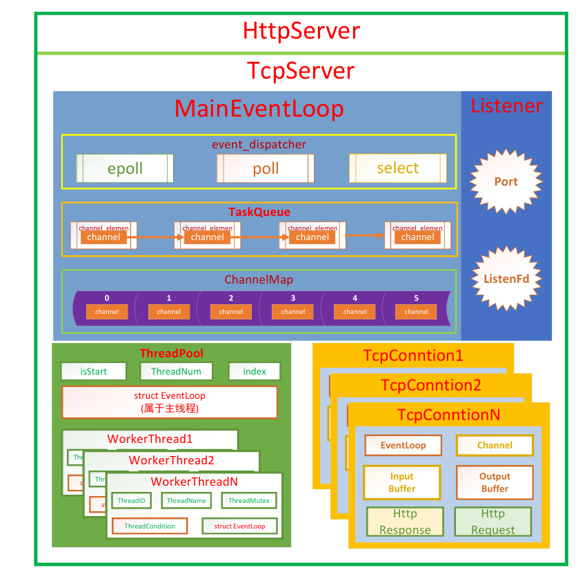
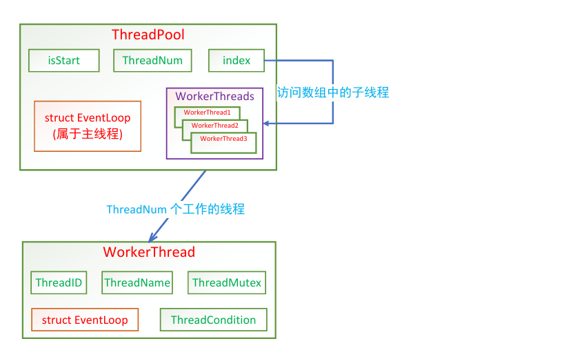
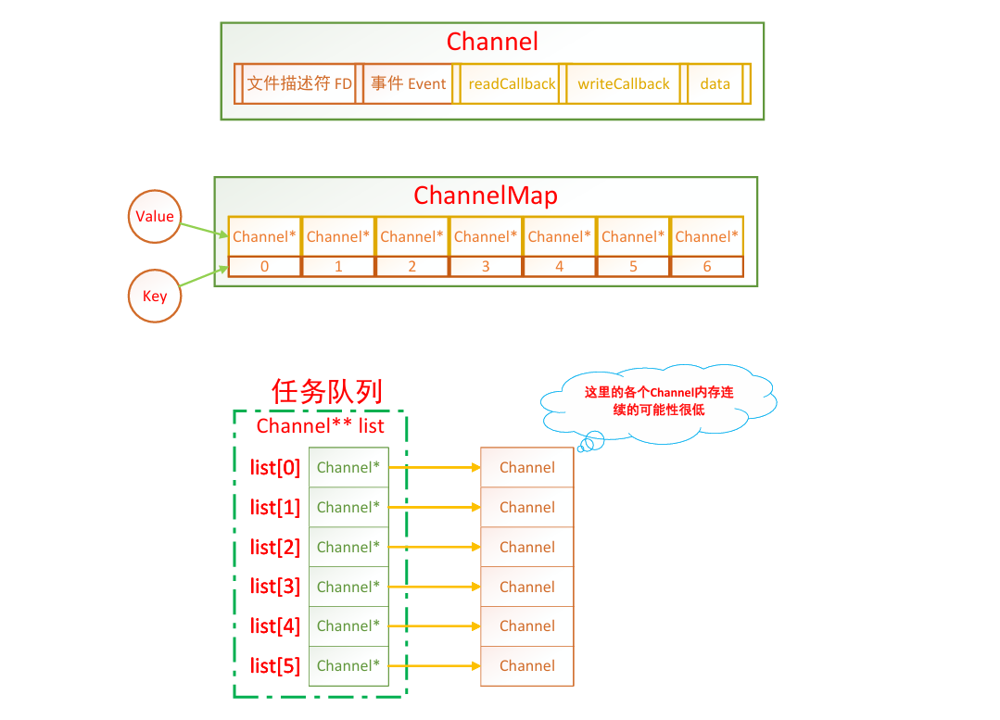
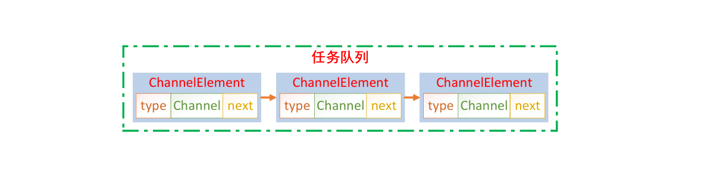
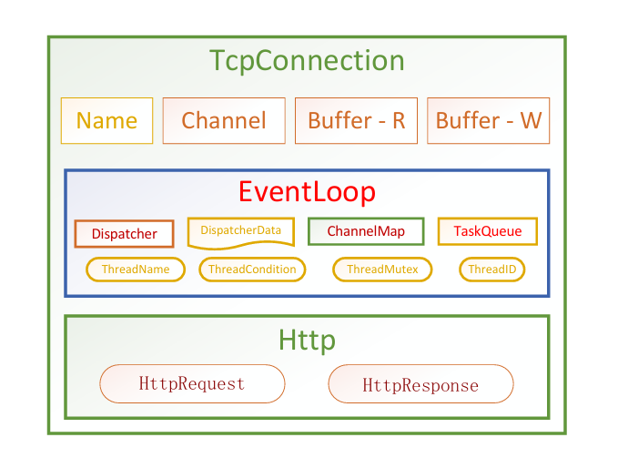
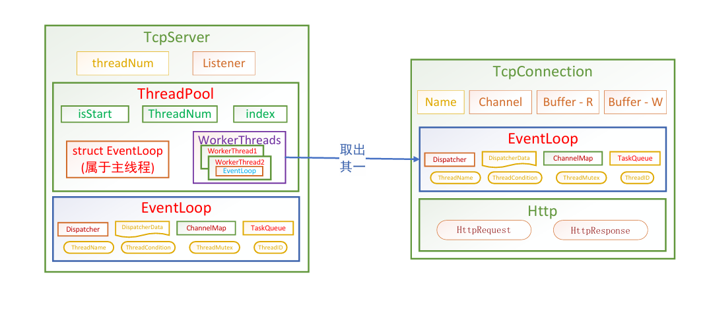

# README

---

1. C语言版本1：多线程 + epoll
2. C语言版本2：线程池 + 单反应堆&多反应堆模型 + select/poll/epoll
3. C++语言版本：C++代码重构 + C11新特性

### 涉及问题

HTTP协议

1. HTTP请求：请求行\请求头\空行\请求数据
2. HTTP响应：状态行\响应头\空行\响应数据

回调函数：

1. 反应堆模型的基础
2. 典型应用：
   - 信号捕捉：signal\sigaction
   - 多线程：pthread_create\thread
   - Qt的信号槽机制：connect
   - 可调用对象包装器\绑定器：function\bind
   - libevent：

### 模块划分

HTTP服务器的核心是TCP服务器，用于监听的套接字、

1. HTTP模块：
   - HttpRequest
   - HttpResponse
2. 服务器模块：
   - Listener
   - TcpServer
   - HttpServer
3. IO模型模块：
   - Buffer
   - TcpConnection
4. 多线程模块：
   - ThreadPool
   - WorkerThread
5. 反应堆模型模块：
   - Channel
   - ChannelMap
   - Dispatcher
     - PollDispatcher
     - EpollDispatcher
     - SelectDispatcher
   - EventLoop

Tcp服务器由以下3个部分组成，用于监听的套接字、主反应堆模型（分发器）、任务队列（对管理的文件描述符进行事件的修改，记录当前的程序有什么需求）、通过文件描述符找到对应的channel，再对回调函数进行调用、

#### 反应堆模型

##### EventLoop

##### Dispatcher

##### ChannelMap

#### IO模型

##### Buffer

##### TcpConnection

#### 初始化与启动流程

服务器初始化与启动整体流程，

