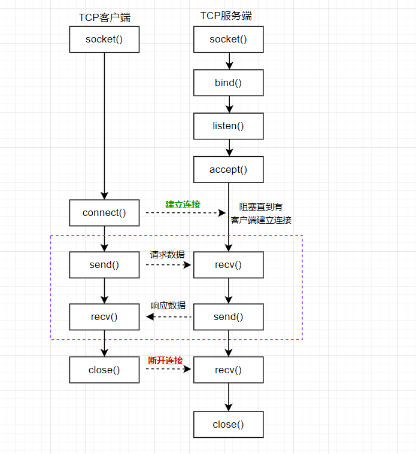
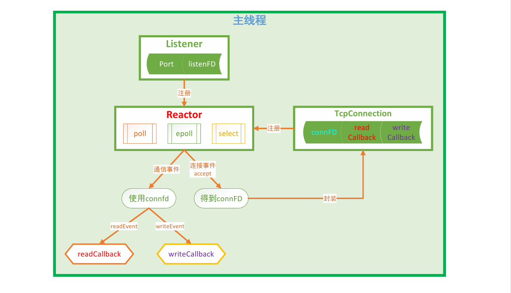
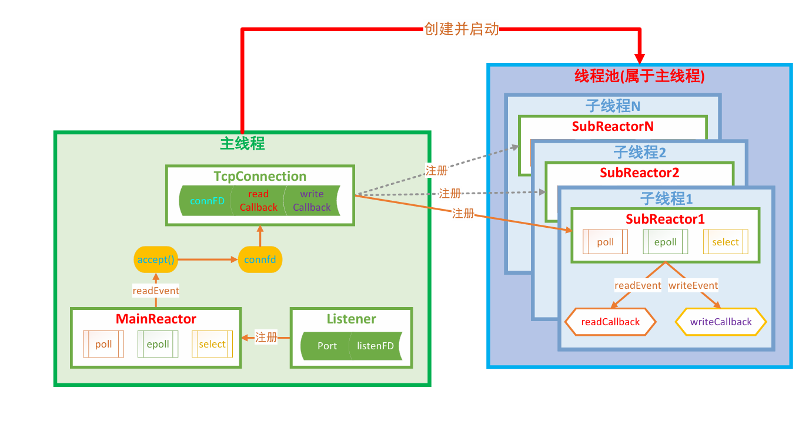

# 基础知识

---

### 通信流程tcp

TCP是一个面向连接的、安全的、流式传输协议，该协议属于传输层协议。

1. 面向连接：是一个双向连接，通过三次握手完成，断开连接需要通过四次挥手完成。
2. 安全：tcp通信过程中，会对发送的每一数据包都会进行校验, 如果发现数据丢失, 会自动重传
3. 流式传输：发送端和接收端处理数据的速度，数据的量都可以不一致

#### server

1. 创建用于监听的套接字，int lfd = socket();
2. 将得到的监听的文件描述符和本地的IP 端口进行绑定，bind();
3. 设置监听客户端连接，listen();
4. 等待并接受客户端的连接请求，建立新的连接，会得到一个新的文件描述符（通信使用）int cfd = accept();
5. 通信，读写操作默认都是阻塞的，
   - 接收数据：read(); / recv();
   - 发送数据：write(); / send();
6. 断开连接, 关闭套接字，close();

在tcp的服务器端，有两类文件描述符：

1. 文件描述符对应内存结构：

   - 1个文件描述符对应两块内存，分别是读缓冲区和写缓冲区，
   - 读数据：通过文件描述符将内存中的数据读出，这块内存称之为读缓冲区
   - 写数据：通过文件描述符将数据写入到某块内存中，这块内存称之为写缓冲区

2. 监听的文件描述符：只需要一个，不负责和客户端通信，负责检测客户端的连接请求，检测到之后调用accept可以建立新的连接，

   - 客户端的连接请求会发送到服务器端监听的文件描述符的读缓冲区中

   - 读缓冲区中有数据，说明有新的客户端连接

   - 调用accept()函数，这个函数会检测监听文件描述符的读缓冲区

     检测不到数据该函数阻塞，如果检测到数据解除阻塞新的连接建立

3. 信的文件描述符：负责和建立连接的客户端通信，如果有N个客户端和服务器建立了新的连接, 通信的文件描述符就有N个，每个客户端和服务器都对应一个通信的文件描述符

   - 客户端和服务器端都有通信的文件描述符，

   - 发送数据：调用函数 write() / send()，数据进入到内核中

     数据并没有被发送出去，而是将数据写入到了通信的文件描述符对应的写缓冲区中，内核检测到通信的文件描述符写缓冲区中有数据, 内核会将数据发送到网络中。

   - 接收数据: 调用的函数 read() / recv(), 从内核读数据

     数据如何进入到内核开发者不需要处理，数据进入到通信的文件描述符的读缓冲区中，数据进入到内核必须使用通信的文件描述符，将数据从读缓冲区中读出即可。

#### client

1. 创建一个通信的套接字，int cfd = socket();
2. 连接服务器, 需要知道服务器绑定的IP和端口，connect();
3. 通信，读写操作默认都是阻塞的，
   - 接收数据：read(); / recv();
   - 发送数据：write(); / send();
4. 断开连接, 关闭套接字，close();

### 并发模型

#### 单反应堆模型

#### 多反应堆模型

